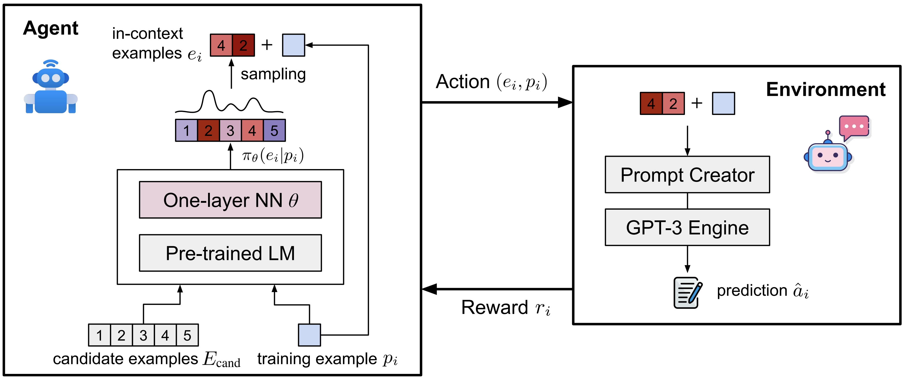
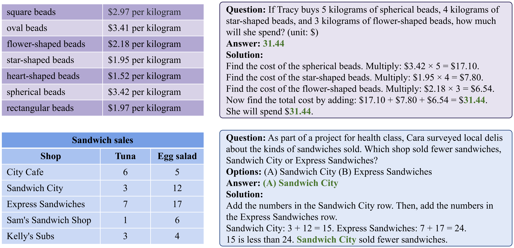
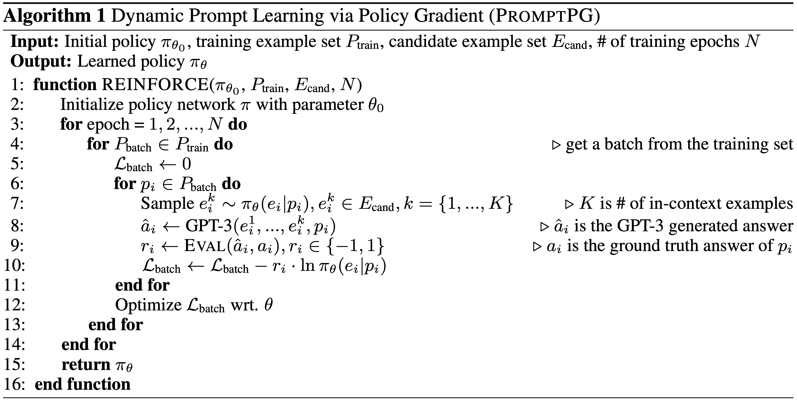
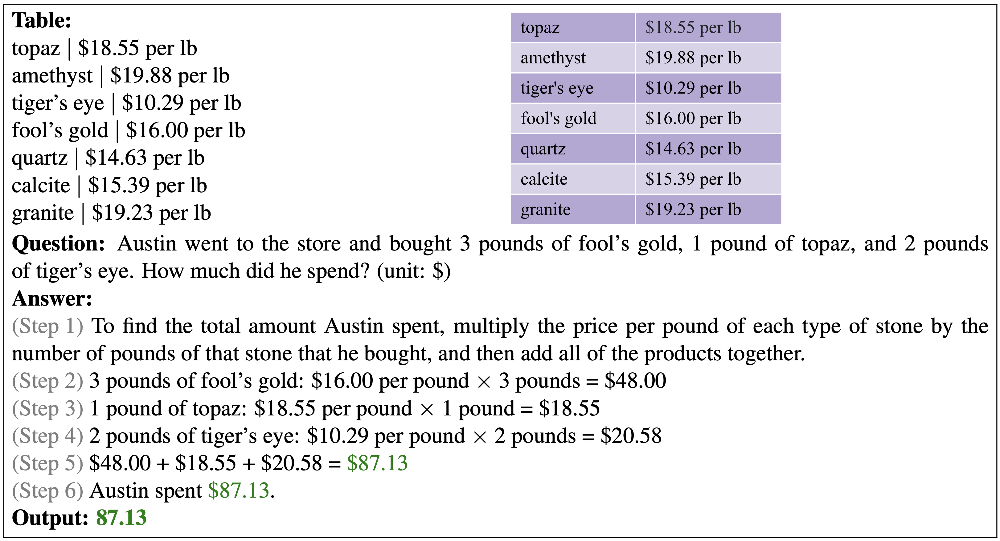

# PromptPG: Prompt Selection via Policy Gradient

   

    

Data and code for our Paper [Dynamic Prompt Learning via Policy Gradient for Semi-structured Mathematical Reasoning](https://arxiv.org/abs/2209.14610).


## About PromptPG

Recent large pre-trained language models such as GPT-3 have achieved remarkable progress on mathematical reasoning tasks written in text form, such as math word problems (MWP). However, it is unknown if the models can handle more complex problems that involve math reasoning over heterogeneous information, such as tabular data. To fill the gap, we present **Tabular Math Word Problems (TabMWP)**, a new dataset containing 38,431 open-domain grade-level problems that require mathematical reasoning on both textual and tabular data.



We evaluate different pre-trained models on TabMWP, including the GPT-3 model in a few-shot setting. As earlier studies suggest, since few-shot GPT-3 relies on the **selection of in-context examples**, its performance is unstable and can degrade to near chance. The unstable issue is more severe when handling complex problems like **TabMWP**. To mitigate this, we further propose a novel approach, **PromptPG**, which utilizes **policy gradient** to learn to **select in-context examples** from a small amount of training data and then constructs the corresponding prompt for the test example. Our proposed PromptPG is able to learn to select performing in-context examples via policy gradient when interacting with the GPT-3 API without any manually designed heuristics.

Experimental results show that our method outperforms the best baseline by **5.31%** on the accuracy metric and reduces the prediction variance significantly compared to random selection. For more details, you can find our project page [here](https://promptpg.github.io/) and our paper [here](https://arxiv.org/abs/2209.14610).


## The TabMWP Dataset

The **TabMWP** dataset contains 38,431 tabular math word problems. Each question in **TabMWP** is aligned with a tabular context, which is presented as an image, semi-structured text, and a structured table. There are two types of questions: *free-text* and *multi-choice*, and each problem is annotated with gold solutions to reveal the multi-step reasoning process. Two examples are shown below.



The **TabMWP** dataset is provided in [`data/tabmwp`](https://github.com/lupantech/PromptPG/blob/main/data/tabmwp). For more details, you can explore the datatset and check out the [Explore](https://promptpg.github.io/explore.html) page and [Visualize](https://promptpg.github.io/visualize.html) page!


## Requirements

```
python==3.8.10
huggingface-hub==0.0.12
numpy==1.23.2
openai==0.23.0
pandas==1.4.3
torch==1.12.1+cu113
transformers==4.21.1
```

Install all required python dependencies:

```
pip install -r requirements.txt
```


## Run GPT-3 via PromptPG for TabMWP

The in-context examples can be randomly or retrieval-based selected from the training set. Recent research, however, has shown that few-shot GPT-3 can be highly unstable across different selections of in-context examples. We aim propose a novel approach, **PromptPG**, that can learn to select performing in-context examples using a policy gradient strategy, without brute-force searching or manually designed heuristics.



### Train the PromptPG Strategy

First, we train the policy network to select 2 (`shot_number=2`) examples from 20 (`cand_number=2`) canditate examples from the training data. With the selected two examples, we build the prompt input for GPT-3 API and get the predictions. The rewards are calulated over 160  (`train_number=2`) training examples and used to update the parameters of policy network.

```sh
cd run_gpt3_rl

python learn_policy.py \
--label exp1 \
--ckpt_root ../checkpoints \
--shot_number 2 \
--prompt_format TQ-SA \
--seed 2 \
--model_config bert-base-uncased \
--train_number 160 \
--cand_number 20 \
--lr 0.001 \
--epochs 20 \
--embedding_size 128 \
--batch_size 20 \
--gpu 0
```

###  Use PromptPG for Inference

We then use the learned policy network to select the in-context examples for the few-shot GPT-3 model on the test set.

```sh
python run_gpt3.py \
--label exp1 \
--ckpt_root ../checkpoints \
--model gpt3_rl \
--test_split test \
--test_number -1 \
--shot_number 2 \
--prompt_format TQ-SA \
--seed 2 \
--cand_number 20 \
--embedding_size 128 \
--model_config bert-base-uncased \
--ckpt exp1/ckpt_best_reward.pt \
--gpu 0
```

It will generate the predictions and save the results at `results/gpt3_rl/exp1_test_TQ-SA_2_seed_2.json`.

For the few-shot GPT-3 model, we repeated the experiments with three different random seeds, and reported the average accuracy in the paper.

### Evaluate the results

Our few-shot GPT-3 model via **PromptPG** achieves a state-of-the-art accuracy of 68.23% on the test split. One prediction example is visualized bellow.



We can get the accuracy metrics on average and across different question classes by running:

```sh
python evaluate_acc.py \
--data_file data/tabmwp/problems_test.json \
--result_root results/gpt3_rl \
--result_files exp1_test_TQ-SA_2_seed_2.json
```

We can repeat the experiments with three different random seeds, and report the average accuracy as the paper did.

```sh
python evaluate_acc.py \
--data_file data/tabmwp/problems_test.json \
--result_root results/gpt3_rl \
--result_files "trial1.json, trial2.json, trial3.json"
```


## Run GPT-3 Baselines

We compare the several GPT-3 baselines on **TabMWP** as follows.

### Zero-shot GPT-3

```sh
python run_gpt3.py \
--label exp1 \
--test_split test \
--test_number -1 \
--shot_number 0 \
--prompt_format TQ-A \
--seed 1
```

### Zero-shot CoT GPT-3

```sh
python run_gpt3_step.py \
--label exp2 \
--test_split test \
--test_number -1 \
--shot_number 0 \
--prompt_format TQ-A \
--seed 1
```

### Few-shot GPT-3

Run the few-shot GPT-3 model:

```sh
python run_gpt3.py \
--label exp3 \
--test_split test \
--test_number -1 \
--shot_number 2 \
--prompt_format TQ-A \
--seed 1
```

Similarly,  we repeat the experiments with three different random seeds, and report the average accuracy as the paper did.

```sh
python evaluate_acc.py \
--data_file data/tabmwp/problems_test.json \
--result_root results/gpt3 \
--result_files "trial1.json, trial2.json, trial3.json"
```

### Few-shot CoT GPT-3

Run the few-shot CoT GPT-3 model:

```sh
python run_gpt3.py \
--label exp4 \
--test_split test \
--test_number -1 \
--shot_number 2 \
--prompt_format TQ-SA \
--seed 1
```

Similarly,  we repeat the experiments with three different random seeds, and report the average accuracy as the paper did.

```sh
python evaluate_acc.py \
--data_file data/tabmwp/problems_test.json \
--result_root results/gpt3 \
--result_files "trial1.json, trial2.json, trial3.json"
```


## Run UnifiedQA

[UnifiedQA](https://github.com/allenai/unifiedqa) is one of the SOTA QA models. We developed both pre-trained and fine-tuned UnifiedQA baselines on **TabMWP**.

For the pre-trained baseline, we load the pre-trained checkpoint and evaluate UnifiedQA on **TabMWP**:

```sh
cd run_t5

python inference.py --label exp1_pretrained_unifiedqa \
--test_split test \
--test_num -1 \
--model small \
--gpu 0 

python eval.py --result_file t5/exp1_pretrained_unifiedqa_small.json
```

For the fine-tuned baseline,  we train UnifiedQA on the training set and evaluate it on the test set:

```sh
cd run_t5

## Training
python train.py --label exp4 \
--model small \
--batch_size 32 \
--eval_batch_size 32 \
--gpu 1

## Inference
python inference.py --label exp4 \
--test_split test \
--test_num -1 \
--model small \
--gpu 1 \
--check_point best_model.pth

python eval.py --result_file t5/exp4_small.json
```


## Run TAPEX

[TAPEX](https://github.com/microsoft/Table-Pretraining) is one of the SOTA TableQA models. We developed both pre-trained and fine-tuned TAPEX baselines on **TabMWP**.

For the pre-trained baseline, we load the pre-trained checkpoint and evaluate TAPEX on **TabMWP**:

```sh
cd run_tapex

## Pre-trained
python inference.py --label exp1 \
--test_split test \
--test_num -1 \
--model tapex-base \
--gpu 0

python eval.py --result_file tapex/exp1_tapex-base.json
```

For the fine-tuned baseline,  we train TAPEX on the training set and evaluate it on the test set:

```sh
cd run_tapex

## Training
python train.py --label exp2 \
--model tapex-base \
--batch_size 16 \
--eval_batch_size 16 \
--gpu 0 \
--save_all

## Inference
python inference.py --label exp2 \
--test_split test \
--test_num -1 \
--model tapex-base \
--gpu 0 \
--check_point best_model.pth

python eval.py --result_file tapex/exp2_tapex-base.json
```


## License

[](https://lbesson.mit-license.org/)

This work is licensed under a [MIT License](http://creativecommons.org/licenses/by-nc-sa/4.0/).

[](https://creativecommons.org/licenses/by-sa/4.0/)

The **TabMWP** dataset is licensed under a [Creative Commons Attribution-NonCommercial-ShareAlike 4.0 International License](http://creativecommons.org/licenses/by-nc-sa/4.0/).


## Cite

If the paper, codes, or the dataset inspire you, please cite us:

```latex
@article{lu2022dynamic,
    title={Dynamic Prompt Learning via Policy Gradient for Semi-structured Mathematical Reasoning},
    author={Lu, Pan and Qiu, Liang and Chang, Kai-Wei and Wu, Ying Nian and Zhu, Song-Chun and Rajpurohit, Tanmay and Clark, Peter and Kalyan, Ashwin},
    journal={arXiv preprint arXiv:2209.14610},
    year={2022}
}
```